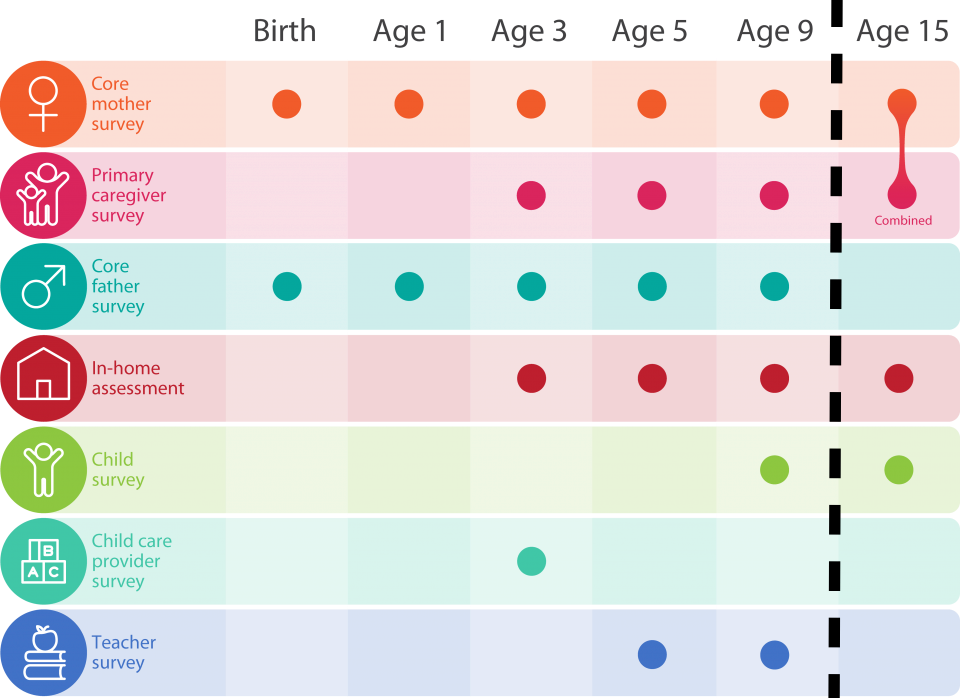
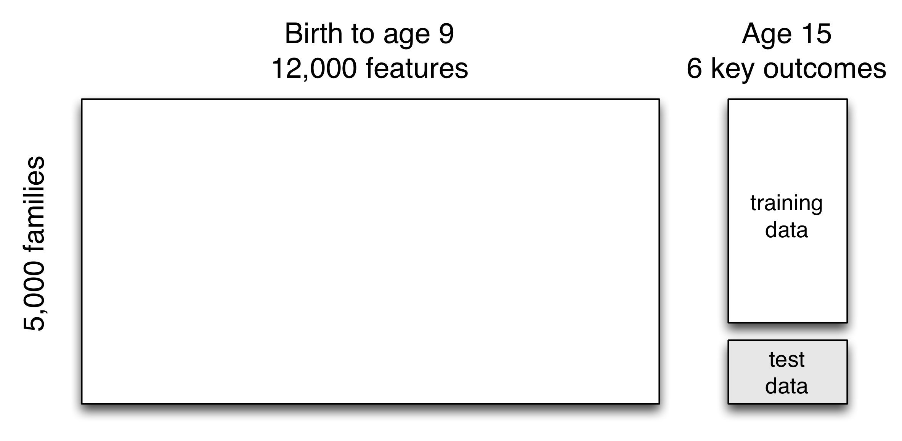
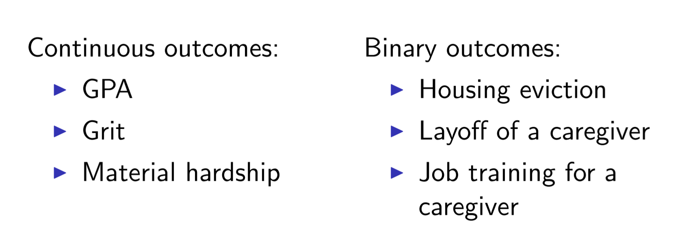
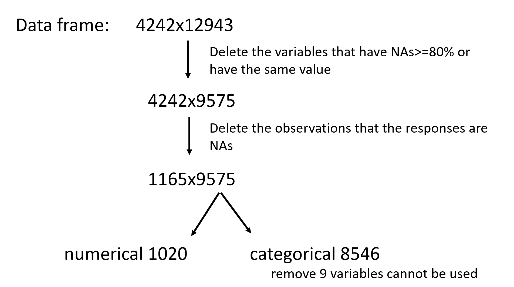
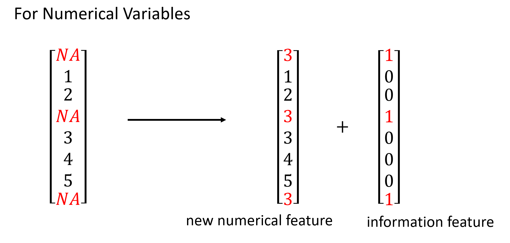
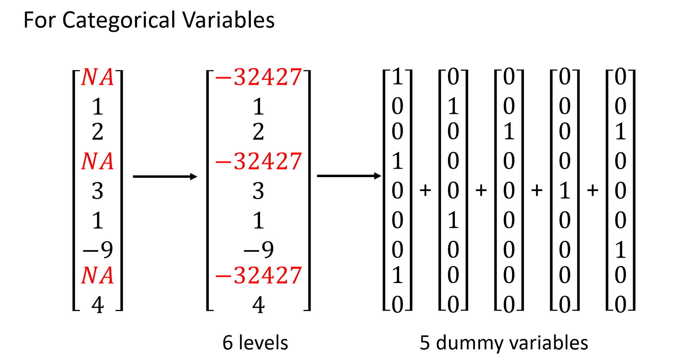
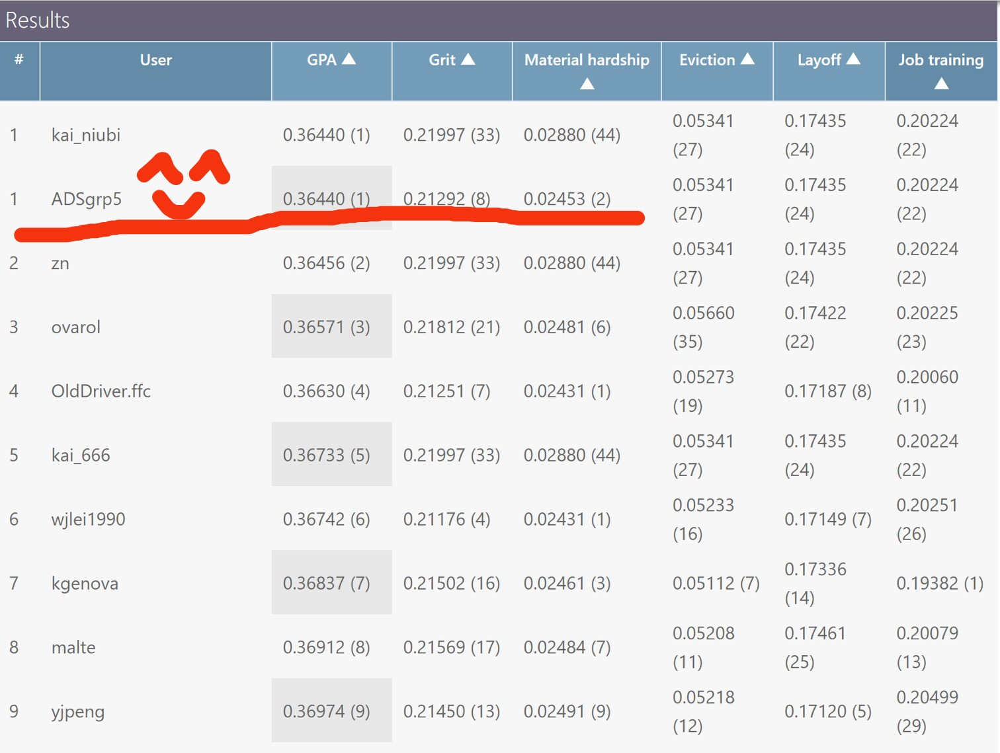

```{r, echo=FALSE, message=FALSE, results='hide'}
memory.limit(10000)
```

# Introduction


## Research Data


## Data Matrix


## Outcomes


# Step 0: Clean Data


```{r, warning=FALSE, message=FALSE, results='hide'}
library(readr)
library(Matrix)
library(mlr)
library(xgboost)
library(plyr)

bg=read_csv('background.csv')
train=read_csv('train.csv')

# Delete the records that corresponding to NA in the train
naid<- which(is.na(train$gpa))
bgtrain<- bg[setdiff(train$challengeID,train$challengeID[naid]),]

# Delete the variables that are 80% NAs
n <- ncol(bgtrain)
na_count<- rep(NA, n)
for(i in 1:n){
        na_count[i]<- sum(is.na(bgtrain[,i]))
}
na_index<- c(1:n)[na_count>=0.8*nrow(bgtrain)]
bgtrain<- bgtrain[,-na_index]

# Delete the variables that have the same value
namelist=names(bgtrain)
for (f in namelist) {
        if(nrow(unique(bgtrain[f]))==1) {
                bgtrain[f]=NULL
        }
}

# Delete the variables that can neither be used as charater 
n<- ncol(bgtrain)
t<- rep(NA, n)
for(i in 1:n){
        t[i]<- typeof(bgtrain[[1,i]])
}
# unique(t)
char_index<- c(1:n)[t=="character"]
inter_index<- c(1:n)[t=="integer"]
dou_index<- c(1:n)[t=="double"]

# seperate the variable by different type, charater are those that cannot
# be convert to any type of data, doubles are continuous data. And intergers may
# contain part of continuous data. Thus, we should also handle these variables.
bgtrain_char<- bgtrain[, char_index]
bgtrain_inter<- bgtrain[, inter_index]
bgtrain_dou<- bgtrain[, dou_index]

# For interger-type variables, check the factor number it contains. And we consider those have
# more than 20 factors as continuous number.
fac_num<- as.numeric(apply(bgtrain_inter, 2, function(vec) 
{return(length(table(vec)))} ))
fac_index<- which(fac_num<=20)
bgtrain_dou<- cbind(bgtrain_inter[,-fac_index], bgtrain_dou)
bgtrain_inter<- bgtrain_inter[,fac_index]

# Fianlly, we get two seperate dataset to deal with in next steps
bgtrain_dou<- data.frame(bgtrain_dou)
bgtrain_inter<- data.frame(bgtrain_inter)
```

## Deal with Numerical Variables

```{r, warning=FALSE}
### fill NA and create new data
fill_each_column <- function(each_col){
        na_label <- is.na(each_col)
        if(sum(na_label) > 0){
                cate_col <- ifelse(na_label == T, 1, 0) ## T = 1, is NA
                fill <- median(each_col, na.rm = T)
                each_col[na_label] <- fill
                return(list(NEW_COLUMN = each_col, NEW_CATE = cate_col))
        }else{
                ## no NA in a column
                return(list(NEW_COLUMN = rep(0,length(each_col)), NEW_CATE = rep(0,length(each_col))))
        }
        
}
```
## Deal with Categorical Variables


# Step 1: Regression and Prediction on GPA
## Model 1: 9-year-old kid numerical variables + numerical information variables
```{r, warning=FALSE}
my.text <- "^([a-z]{1,3}5)"
indices <- grepl(my.text,colnames(bgtrain_dou))
mat <- bgtrain_dou[,indices]

## INPUT data= continuous dataframe 
gp5data_dou <- mat
gp5data_dou <- matrix(unlist(gp5data_dou), nrow(gp5data_dou))
## 1 for new column, 2 for new categorical features
gp5data_dou_RMNA <- apply(gp5data_dou, 2, function(col){fill_each_column(col)[[1]]})
cate_dou_na <- apply(gp5data_dou, 2, function(col){fill_each_column(col)[[2]]})

# remove NON-NA columns
non_na_dou <- colSums(cate_dou_na) == 0
cate_dou_na <- cate_dou_na[,!non_na_dou]
bg_dou <- bg[,colnames(mat)]

gp5pred_dou <- bg_dou
gp5pred_dou <- matrix(unlist(gp5pred_dou), nrow(gp5pred_dou))
## 1 for new column, 2 for new categorical features
gp5pred_dou_RMNA <- apply(gp5pred_dou, 2, function(col){fill_each_column(col)[[1]]})
cate_pred_dou_na <- apply(gp5pred_dou, 2, function(col){fill_each_column(col)[[2]]})

dtrain=xgb.DMatrix(cbind(data.matrix(mat),cate_dou_na),label=train$gpa[which(!is.na(train$gpa))])
dtest=xgb.DMatrix(cbind(data.matrix(bg_dou),cate_pred_dou_na))
#dtest=xgb.DMatrix(new_features_test)
params=list(
        objective='reg:linear',
        subsample=0.9,
        colsample_bytree=0.8,
        eta=0.05,
        max_depth=1
)

xgb.cv(nfold=10,data=dtrain,params = params,nround=300, print_every_n = 50)
model=xgb.train(data=dtrain,params=params,nrounds=100)
imp=xgb.importance(model=model)
xgb.plot.importance(importance_matrix = imp)
sub=predict(model,dtest)
```

## Model 2: 9-year-old kid categorical and KMeans
```{r, warning=FALSE}
######## K-MEANS func
new_features_kmeans <- function(data, K){
  ## Return cluster.id
  kmeans_results <- kmeans(data, centers = K, iter.max = 500)
  return(kmeans_results$cluster)
}
####################
generate_new_f_kmeans <- function(data, cluster.id){
  new_data_lm <- data.frame(CLUS = cluster.id,
                            Records = data)
  new_data_lm_done <- ddply((new_data_lm), .(CLUS), colMeans)
  return(DATA = t(new_data_lm_done[,-1]))
}

bg_dou <- bg[,colnames(bgtrain_dou)]

gp5pred_dou <- bg_dou
gp5pred_dou <- matrix(unlist(gp5pred_dou), nrow(gp5pred_dou))
## 1 for new column, 2 for new categorical features
gp5pred_dou_RMNA <- apply(gp5pred_dou, 2, function(col){fill_each_column(col)[[1]]})
cate_pred_dou_na <- apply(gp5pred_dou, 2, function(col){fill_each_column(col)[[2]]})

my.text <- "^([a-z]{1,3}5)"
indices <- grepl(my.text, colnames(bgtrain_inter))
mat <- bgtrain_inter[,indices]

#grp5_cate_422 <- bgtrain_inter
grp5_cate_422 <- mat
grp5_cate_422[is.na(grp5_cate_422)] <- -32767
for (iter in 1:ncol(grp5_cate_422 )){
  grp5_cate_422[,iter] <- as.factor(grp5_cate_422[,iter])
}
aaa <- apply(grp5_cate_422, 2, createDummyFeatures)

aaa1 <- matrix(ncol = 0, nrow = nrow(grp5_cate_422))
for (iter in 1:length(aaa)){
  aaa1 <- cbind(aaa1, aaa[[iter]][,2:ncol(aaa[[iter]])])
}

cs.id <- new_features_kmeans(t(aaa1), K = 250)
new_features_train <- generate_new_f_kmeans(t(aaa1), cs.id)

## bg_dou_cate begin
bg_inter <- bg[, colnames(mat)]
grp5_pre_cate_422 <- bg_inter
grp5_pre_cate_422[is.na(grp5_pre_cate_422)] <- -32767
grp5_pre_cate_422 <- data.frame(grp5_pre_cate_422)

for (iter in 1:ncol(grp5_pre_cate_422 )){
  set1 <- colnames(aaa[[iter]])
  grp5_pre_cate_422[!(grp5_pre_cate_422[,iter] %in% as.numeric(set1)),iter] <- -32767
  grp5_pre_cate_422[,iter] <- as.factor(grp5_pre_cate_422[,iter])
}

aaa_pre <- apply(grp5_pre_cate_422, 2, createDummyFeatures) 
## This is a list
aaa_pre1 <- matrix(ncol = 0, nrow = nrow(grp5_pre_cate_422))
for (iter in 1:length(aaa_pre)){
  aaa_temp <- aaa_pre[[iter]][,colnames(aaa[[iter]])]
  aaa_temp <- aaa_temp[,2:ncol(aaa[[iter]])]
  aaa_pre1 <- cbind(aaa_pre1, aaa_temp)
}
## k-means features
new_features_test <- generate_new_f_kmeans(t(aaa_pre1), cs.id)

## XGBOOST FEATURES
dtrain=xgb.DMatrix(data.matrix(new_features_train),label=train$gpa[which(!is.na(train$gpa))])
dtest=xgb.DMatrix(data.matrix(new_features_test))
#dim(dtrain)
#dim(dtest)

params=list(
  objective='reg:linear',
  subsample=0.9,
  colsample_bytree=1,  ## This can be modified 
  eta=0.05,
  max_depth=1
)

xgb.cv(nfold=10,data = dtrain, params = params, nround = 300, print_every_n = 50)
model8=xgb.train(data=dtrain,params=params,nrounds=200)
imp=xgb.importance(model=model8)
xgb.plot.importance(importance_matrix = imp)
cate_result <- predict(model8,dtest)
```

## Bagging the two results, that is, given equal weights to the two results and get our final prediction
```{r, eval=FALSE}
cate_result <- predict(model8,dtest)
nie <- read_csv('prediction1.csv')
yyy <- nie
yyy$gpa <- 0.5 * nie$gpa + 0.5 * cate_result
hist(yyy$gpa)
write_csv(yyy,'prediction.csv')
```

# Step 3: Regression and Prediction on Grit & Material Hardship
## Grit: Categorical variables related to 9-year-old kids
```{r, warning=FALSE, error=FALSE}
naid<- which(is.na(train$grit))
bgtrain<- bg[setdiff(train$challengeID,train$challengeID[naid]),]
n <- ncol(bgtrain)
na_count<- rep(NA, n)
for(i in 1:n){
        na_count[i]<- sum(is.na(bgtrain[,i]))
}
na_index<- c(1:n)[na_count>=0.8*nrow(bgtrain)]
bgtrain<- bgtrain[,-na_index]

namelist=names(bgtrain)
for (f in namelist) {
        if(nrow(unique(bgtrain[f]))==1) {
                bgtrain[f]=NULL
        }
}
n<- ncol(bgtrain)
t<- rep(NA, n)
for(i in 1:n){
        t[i]<- typeof(bgtrain[[1,i]])
}
char_index<- c(1:n)[t=="character"]
inter_index<- c(1:n)[t=="integer"]
dou_index<- c(1:n)[t=="double"]

bgtrain_char<- bgtrain[, char_index]
bgtrain_inter<- bgtrain[, inter_index]
bgtrain_dou<- bgtrain[, dou_index]

fac_num<- as.numeric(apply(bgtrain_inter, 2, function(vec) 
{return(length(table(vec)))} ))
fac_index<- which(fac_num<=15)
bgtrain_dou<- cbind(bgtrain_inter[,-fac_index], bgtrain_dou)
bgtrain_inter<- bgtrain_inter[,fac_index]

bgtrain_dou<- data.frame(bgtrain_dou)
bgtrain_inter<- data.frame(bgtrain_inter)

### fill NA and create new data
fill_each_column <- function(each_col){
        na_label <- is.na(each_col)
        if(sum(na_label) > 0){
                cate_col <- ifelse(na_label == T, 1, 0) ## T = 1, is NA
                fill <- median(each_col, na.rm = T)
                each_col[na_label] <- fill
                return(list(NEW_COLUMN = each_col, NEW_CATE = cate_col))
        }else{
                ## no NA in a column
                return(list(NEW_COLUMN = rep(0,length(each_col)), NEW_CATE = rep(0,length(each_col))))
        }
}
## INPUT data= continuous dataframe 
gp5data_dou <- bgtrain_dou
gp5data_dou <- matrix(unlist(gp5data_dou), nrow(gp5data_dou))
## 1 for new column, 2 for new categorical features
gp5data_dou_RMNA <- apply(gp5data_dou, 2, function(col){fill_each_column(col)[[1]]})
cate_dou_na <- apply(gp5data_dou, 2, function(col){fill_each_column(col)[[2]]})

## remove NON-NA columns
non_na_dou <- colSums(cate_dou_na) == 0
cate_dou_na <- cate_dou_na[,!non_na_dou]

bg_dou <- bg[,colnames(bgtrain_dou)]
gp5pred_dou <- bg_dou
gp5pred_dou <- matrix(unlist(gp5pred_dou), nrow(gp5pred_dou))
## 1 for new column, 2 for new categorical features
gp5pred_dou_RMNA <- apply(gp5pred_dou, 2, function(col){fill_each_column(col)[[1]]})
cate_pred_dou_na <- apply(gp5pred_dou, 2, function(col){fill_each_column(col)[[2]]})

my.text <- "^(k5|p5|o5|n5|hv5)"
indices <- grepl(my.text, colnames(bgtrain_inter))
mat <- bgtrain_inter[,indices]

grp5_cate_422 <- mat
grp5_cate_422[is.na(grp5_cate_422)] <- -32767
for (iter in 1:ncol(grp5_cate_422 )){
        grp5_cate_422[,iter] <- as.factor(grp5_cate_422[,iter])
}
aaa <- apply(grp5_cate_422, 2, createDummyFeatures)

aaa1 <- matrix(ncol = 0, nrow = nrow(grp5_cate_422))
for (iter in 1:length(aaa)){
        aaa1 <- cbind(aaa1, aaa[[iter]][,2:ncol(aaa[[iter]])])
}

bg_inter <- bg[, colnames(mat)]
grp5_pre_cate_422 <- bg_inter
grp5_pre_cate_422[is.na(grp5_pre_cate_422)] <- -32767
grp5_pre_cate_422 <- data.frame(grp5_pre_cate_422)

for (iter in 1:ncol(grp5_pre_cate_422 )){
        set1 <- colnames(aaa[[iter]])
        grp5_pre_cate_422[!(grp5_pre_cate_422[,iter] %in% as.numeric(set1)),iter] <- -32767
        grp5_pre_cate_422[,iter] <- as.factor(grp5_pre_cate_422[,iter])
}

aaa_pre <- apply(grp5_pre_cate_422, 2, createDummyFeatures) ## This is a list
aaa_pre1 <- matrix(ncol = 0, nrow = nrow(grp5_pre_cate_422))
for (iter in 1:length(aaa_pre)){
        aaa_temp <- aaa_pre[[iter]][,colnames(aaa[[iter]])]
        aaa_temp <- aaa_temp[,2:ncol(aaa[[iter]])]
        aaa_pre1 <- cbind(aaa_pre1, aaa_temp)
}
## bg_dou_cate end

dtrain=xgb.DMatrix(cbind(data.matrix(aaa1),cate_dou_na),label=train$grit[which(!is.na(train$grit))])
dtest=xgb.DMatrix(cbind(data.matrix(aaa_pre1),cate_pred_dou_na))
params=list(
        objective='reg:linear',
        subsample=0.9,
        colsample_bytree=0.6,
        eta=0.05,
        max_depth=1
)

xgb.cv(nfold=10,data=dtrain,params = params,nround=600,print_every_n = 100)
model8=xgb.train(data=dtrain,params=params,nrounds=500)
imp=xgb.importance(model=model8)
xgb.plot.importance(importance_matrix = imp)
sub=predict(model8,dtest)
```

## Material Hardship: Mother's categorical variables, and use Kmeans on categorical dummy variables
```{r, warning=FALSE, error=FALSE}
naid<- which(is.na(train$materialHardship))
bgtrain<- bg[setdiff(train$challengeID,train$challengeID[naid]),]
n <- ncol(bgtrain)
na_count<- rep(NA, n)
for(i in 1:n){
        na_count[i]<- sum(is.na(bgtrain[,i]))
}
na_index<- c(1:n)[na_count>=0.8*nrow(bgtrain)]
bgtrain<- bgtrain[,-na_index]

# Delete the variables that have the same value
namelist=names(bgtrain)
for (f in namelist) {
        if(nrow(unique(bgtrain[f]))==1) {
                bgtrain[f]=NULL
        }
}

n<- ncol(bgtrain)
t<- rep(NA, n)
for(i in 1:n){
        t[i]<- typeof(bgtrain[[1,i]])
}

char_index<- c(1:n)[t=="character"]
inter_index<- c(1:n)[t=="integer"]
dou_index<- c(1:n)[t=="double"]
bgtrain_char<- bgtrain[, char_index]
bgtrain_inter<- bgtrain[, inter_index]
bgtrain_dou<- bgtrain[, dou_index]
fac_index<- which(fac_num<=15)
bgtrain_dou<- cbind(bgtrain_inter[,-fac_index], bgtrain_dou)
bgtrain_inter<- bgtrain_inter[,fac_index]
bgtrain_dou<- data.frame(bgtrain_dou)
bgtrain_inter<- data.frame(bgtrain_inter)
### fill NA and create new data
fill_each_column <- function(each_col){
        na_label <- is.na(each_col)
        if(sum(na_label) > 0){
                cate_col <- ifelse(na_label == T, 1, 0) ## T = 1, is NA
                fill <- median(each_col, na.rm = T)
                each_col[na_label] <- fill
                return(list(NEW_COLUMN = each_col, NEW_CATE = cate_col))
        }else{
                ## no NA in a column
                return(list(NEW_COLUMN = rep(0,length(each_col)), NEW_CATE = rep(0,length(each_col))))
        }
        
        
}
my.text <- "^(m)"
indices <- grepl(my.text, colnames(bgtrain_dou))
mat <- bgtrain_dou[,indices]

## INPUT data= continuous dataframe 
gp5data_dou <- mat
gp5data_dou <- matrix(unlist(gp5data_dou), nrow(gp5data_dou))
## 1 for new column, 2 for new categorical features
gp5data_dou_RMNA <- apply(gp5data_dou, 2, function(col){fill_each_column(col)[[1]]})
cate_dou_na <- apply(gp5data_dou, 2, function(col){fill_each_column(col)[[2]]})
## remove NON-NA columns
non_na_dou <- colSums(cate_dou_na) == 0
cate_dou_na <- cate_dou_na[,!non_na_dou]

bg_dou <- bg[,colnames(mat)]
gp5pred_dou <- bg_dou
gp5pred_dou <- matrix(unlist(gp5pred_dou), nrow(gp5pred_dou))
## 1 for new column, 2 for new categorical features
gp5pred_dou_RMNA <- apply(gp5pred_dou, 2, function(col){fill_each_column(col)[[1]]})
cate_pred_dou_na <- apply(gp5pred_dou, 2, function(col){fill_each_column(col)[[2]]})
dtrain=xgb.DMatrix(data.matrix(mat),label=train$materialHardship[which(!is.na(train$materialHardship))])
dtest=xgb.DMatrix(data.matrix(bg_dou))
params=list(
        objective='reg:linear',
        subsample=0.9,
        colsample_bytree=0.8,
        eta=0.05,
        max_depth=1
)

model=xgb.train(data=dtrain,params=params,nrounds=200)
imp=xgb.importance(model=model)
my.text <- "^(m)"
indices <- grepl(my.text, colnames(bgtrain_inter))
mat <- bgtrain_inter[,indices]

grp5_cate_422 <- mat
grp5_cate_422[is.na(grp5_cate_422)] <- -32767
for (iter in 1:ncol(grp5_cate_422 )){
        grp5_cate_422[,iter] <- as.factor(grp5_cate_422[,iter])
}
aaa <- apply(grp5_cate_422, 2, createDummyFeatures)

aaa1 <- matrix(ncol = 0, nrow = nrow(grp5_cate_422))
for (iter in 1:length(aaa)){
        aaa1 <- cbind(aaa1, aaa[[iter]][,2:ncol(aaa[[iter]])])
}
bg_inter <- bg[, colnames(mat)]
grp5_pre_cate_422 <- bg_inter
grp5_pre_cate_422[is.na(grp5_pre_cate_422)] <- -32767
grp5_pre_cate_422 <- data.frame(grp5_pre_cate_422)
for (iter in 1:ncol(grp5_pre_cate_422 )){
        set1 <- colnames(aaa[[iter]])
        grp5_pre_cate_422[!(grp5_pre_cate_422[,iter] %in% as.numeric(set1)),iter] <- -32767
        grp5_pre_cate_422[,iter] <- as.factor(grp5_pre_cate_422[,iter])
}
#### 

aaa_pre <- apply(grp5_pre_cate_422, 2, createDummyFeatures) ## This is a list

aaa_pre1 <- matrix(ncol = 0, nrow = nrow(grp5_pre_cate_422))
for (iter in 1:length(aaa_pre)){
        aaa_temp <- aaa_pre[[iter]][,colnames(aaa[[iter]])]
        aaa_temp <- aaa_temp[,2:ncol(aaa[[iter]])]
        aaa_pre1 <- cbind(aaa_pre1, aaa_temp)
}
## bg_dou_cate end

new_features_kmeans <- function(data, K){
        ## Return cluster.id
        kmeans_results <- kmeans(t(data), centers = K, iter.max = 100)
        return(kmeans_results$cluster)
}

generate_new_f_kmeans <- function(data, cluster.id){
        new_data_lm <- data.frame(CLUS = cluster.id, 
                                  Records = t(data))
        new_data_lm_done <- ddply((new_data_lm), .(CLUS), colMeans)
        return(DATA = t(new_data_lm_done[,-1]))
}

cs.id <- new_features_kmeans(data = aaa1, K =150)
new_features_train <- generate_new_f_kmeans(aaa1, cs.id)
new_features_test <- generate_new_f_kmeans(aaa_pre1, cs.id)

dtrain=xgb.DMatrix(cbind(data.matrix(new_features_train),cate_dou_na),label=train$materialHardship[which(!is.na(train$materialHardship))])
dtest=xgb.DMatrix(cbind(data.matrix(new_features_test),cate_pred_dou_na))
params=list(
        objective='reg:linear',
        subsample=0.9,
        colsample_bytree=0.8,
        eta=0.05,
        max_depth=1
)

xgb.cv(nfold=10,data=dtrain,params = params,nround=300, print_every_n = 50)
model8=xgb.train(data=dtrain,params=params,nrounds=200)
imp=xgb.importance(model=model8)
xgb.plot.importance(importance_matrix = imp)
```

# Final Results



